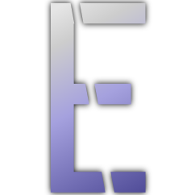

# Engin3

  

This is a very simple project that aims to help me learn how graphics work and how to develop a simple game engine. It is __NOT__ a serious tool but a learning project, so please keep that in mind.

## Status
Currently, only work on the "Editor" part is being done. Once i'm satisfied with that, the next step would be to get the "runtime" working, meaning
being able to load a "cooked" game from a single asset file.

## Architecture
The engine uses a "component" based system. Entities exist in the world and can have multiple components attached to them. It follows the logic of Unity's MonoBehaviour and not an ECS.
The reason for this is that i just feel more comfortable working with this type of components and speed is not a hude concern right now.

## Building and Running
> [!WARNING]  
> The project is highly volatile and there is a chance you won't be able to compile vendor libraries and/or get linking errors.
> If you do encounter such issues, please open in issue, i would love to help you get it working!

### Odin
First, you need to [install](https://odin-lang.org/docs/install/) Odin and make sure the `odin` executable is in your PATH.

### Building third party libraries
- Linux
  - Run `./packages/build.sh` to build the necessary libraries.
- Windows
  - Make sure you have the MSVC build tools installed. If not, consider using [this](https://github.com/Data-Oriented-House/PortableBuildTools).
  - Run `packages/build.bat` to build the necessary libraries.

### Task
This project uses [Task](https://taskfile.dev), a simple task runner.
Task is used to run multiple meta programs to generate compile time information and bindings for lua scripts.

Task is a single binary and can easily be installed:
- On Windows: `winget install Task.Task`
- On Linux: `Use your package manager`

Once installed, execute `task run` at the project root.

### Discord
Everybody and their mum has a discord server, so why not me? :)
[Join the Discord](https://discord.gg/K9QfYjKwng)

### Screenshots

