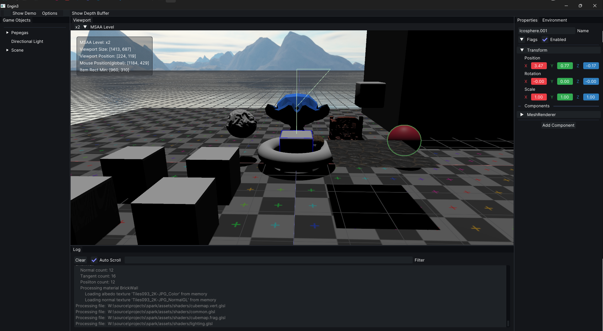
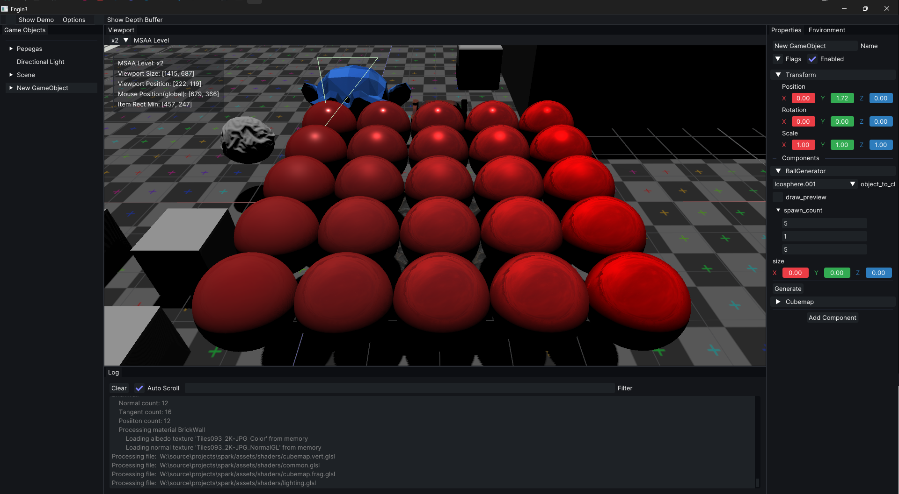

## Engin3
This is a very simple project that aims to help me learn how graphics work and how to develop a simple game engine.
Currently the editor and the "game" are in the same package, because i don't care about separating them yet. 
The editor is not meant as a "generic" project editor and is instead tied with the "game" project. In the future, once i figure more stuff out,
this might change.

### Building and Running
First, you need to [install](https://odin-lang.org/docs/install/) Odin and make sure the `odin` executable is in your PATH.

This project uses [Task](https://taskfile.dev), a simple task runner. Task is a single binary and can easily be installed:
- On Windows: `winget install Task.Task`
- On Linux: `Use your package manager`

Right now, library binaries for windows are included in the repo for ease of use.
For linux, you will need to compile them yourself:
- Run `./packages/build.sh` to build the necessary libraries.

Once installed, execute `task run` at the project root and everything should be build correctly.
Task is used to run a meta program when needed and to compile needed libraries for first-time use.

### Screenshots

